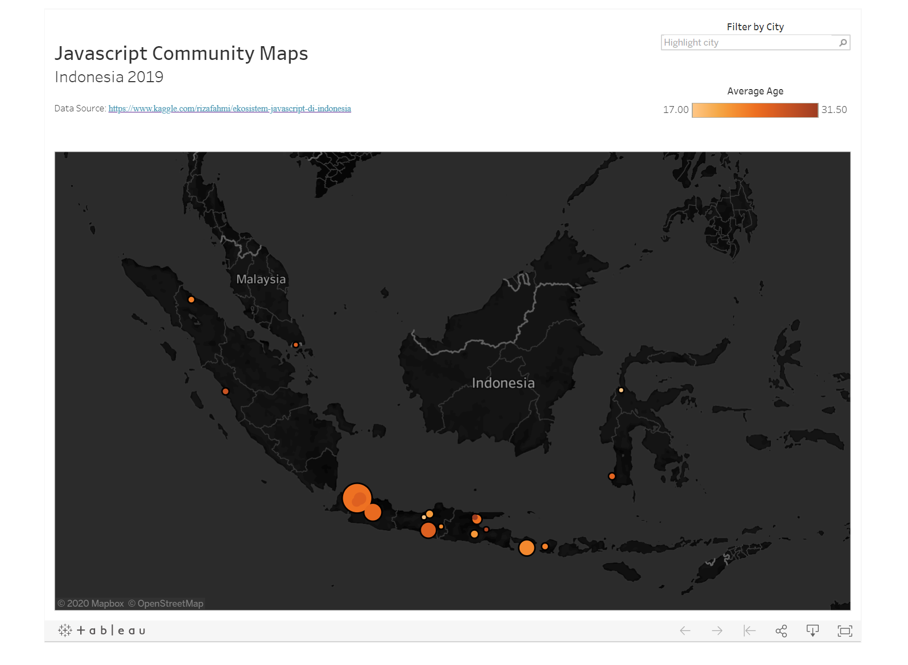

# Indonesia JavaScript 2019 in Number

🚀 **Preview**
- Tableau Public: [click here](https://public.tableau.com/profile/albert.bill.alroy#!/vizhome/JavascriptCommunityinIndonesia/Dashboard1)

🔧 **Tools**
- Data Source: [Ekosistem JavaScript di Indonesia 2019](https://www.kaggle.com/rizafahmi/ekosistem-javascript-di-indonesia)
- Data Analytics: Numpy, Pandas, and Plotly
